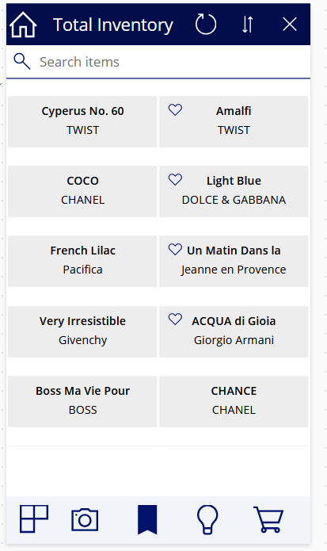
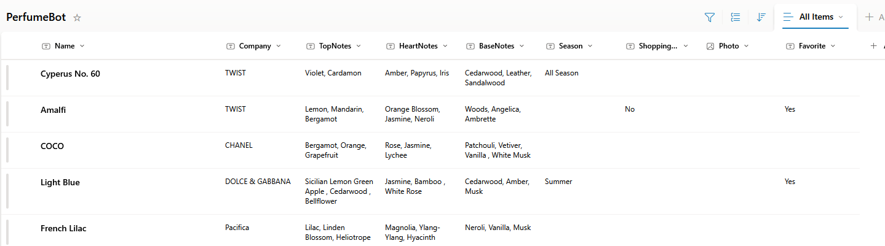

# AI Perfume Inventory App

## Overview

The AI Perfume Inventory App is a Power App that leverages AI Builder to detect perfume bottles and their labels. The app can identify the font on the bottle and extract key information such as the company name, perfume name, scent notes, and inventory details. It saves the extracted data to a SharePoint list. 





SharePoint list:



## Features

- **AI Detection**: Utilizes AI Builder to detect and recognize perfume bottles.
- **Font Recognition**: Identifies and reads the font on the perfume bottle to extract text.
- **Information Extraction**: Pulls key details including the company name, perfume name, and scent notes.
- **Inventory Management**: Keeps track of the inventory of detected perfume bottles.

## Getting Started | Setup Information

1. **Clone the repository**:
    ```sh
    git clone https://github.com/gretchunkim/ai-perfume-inventory-app.git
    ```

2. **Open in Power Apps**:
    - Open Power Apps Studio.
    - Import the app package from the cloned repository.

3. **Configure AI Builder**:
    - Ensure you have an AI Builder license.
    - Set up the AI model for detecting perfume bottles and extracting text.

4. **Run the App**:
    - Launch the app in Power Apps.
    - Use the camera to scan perfume bottles or upload existing photo information and press "Save" to see the extracted information and save it to a SharePoint list.

## Requirements

- Power Apps Premium license
- AI Builder license
- Camera-enabled device
- SharePoint list for storing inventory data (Ensure to match SHarePoint list column names with the app's data)

